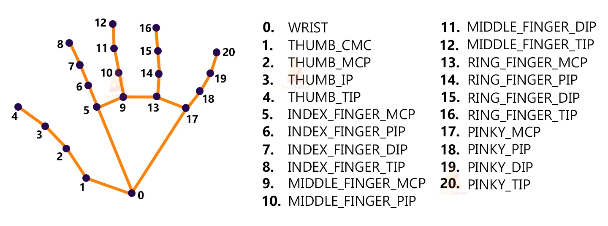

# Hand Sign Detection App - README

## Overview

This application utilizes machine learning and computer vision techniques to detect and interpret hand signs. With the ability to recognize various gestures, it can be implemented for user interfaces, sign language translation, and other interactive applications.

## Features

- Detection of the following hand signs:
  - **Okay**: Thumb and index finger touching to form a circle.
  - **Peace**: Index and middle fingers raised in a V shape.
  - **Thumbs Up**: Thumb raised, signaling approval or agreement.
  - **Thumbs Down**: Thumb pointed downwards, signaling disapproval or disagreement.
  - **Call Me**: Pinky and thumb extended, mimicking a telephone.
  - **Stop**: Hand raised with palm facing forward, signaling to halt.
  - **Rock**: Fist with only the index and pinky fingers extended upwards.
  - **Live Long**: Similar to the peace sign but with the thumb extended.
  - **Fist**: Hand closed into a fist.
  - **Smile**: A non-hand sign, presumably detected based on facial recognition.

## Installation

1. Ensure you have Python installed on your system.
2. Open a terminal or command prompt.
3. Navigate to the directory where the app is located.
4. Run the following commands to set up the environment and start the application:

```shell
sudo sh install_requirements.sh
python app.py
```

## Usage

Once the application is running:

1. Allow the app to access your camera.
2. Position your hand within the camera frame.
3. Perform one of the hand signs listed above.
4. The app will detect and display the corresponding hand sign label on the screen.

## Technical Details

The application uses a pre-trained model for hand landmark detection, mapping 21 points on a hand from the wrist to the fingertips.



Each hand sign is associated with a specific configuration of these landmarks. When a hand gesture is performed, the application processes the image, identifies the landmarks, and matches them to the closest corresponding hand sign.

## Contribution

Contributions to the project are welcome. You can contribute by improving the detection algorithm, adding more hand signs, or optimizing the performance.

## License

This project is licensed under the MIT License - see the LICENSE file for details.
